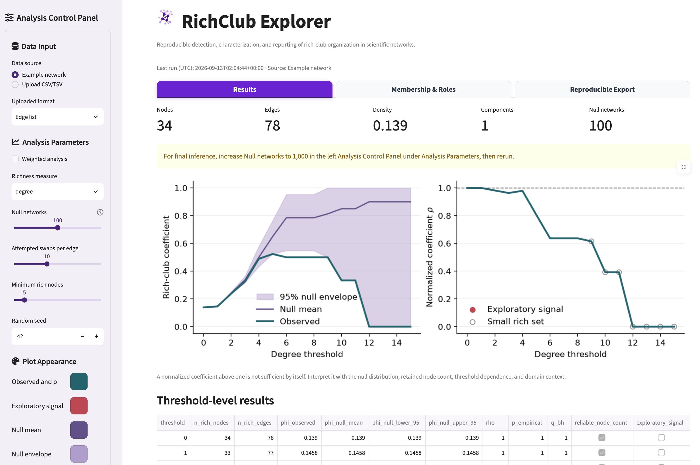

# RichClub Explorer

[](https://github.com/adriennekline/richclub-explorer/actions/workflows/tests.yml)
[](LICENSE)

**RichClub Explorer** is an open-source platform for reproducible detection,
characterization, and reporting of rich-club organization in scientific networks.
It pairs a tested Python analysis engine with a point-and-click Streamlit interface
for researchers who do not routinely write code.

> **Project status:** Research software in alpha. The binary, undirected workflow is
> the primary validated path in v0.1. Weighted inference is provided for exploration
> and carries an explicit null-model limitation.



## Why this project exists

Calculating a rich-club coefficient is straightforward. Drawing a defensible
scientific conclusion is not. RichClub Explorer keeps the important analytical
choices visible and reports the observed curve together with a null ensemble,
uncertainty envelope, empirical significance, retained node counts, and the actual
nodes and edges underlying a result.

## Features

- CSV/TSV edge-list and adjacency-matrix input
- Automated checks for directionality, duplicates, self-loops, asymmetry,
  missing values, disconnected components, and invalid weights
- Binary rich-club coefficients across degree thresholds
- Exploratory weighted coefficients across degree or strength thresholds
- Ensembles of degree-preserving randomized networks
- Normalized coefficients, 95% null envelopes, and empirical one-sided p-values
- Warnings when a threshold retains too few nodes for stable interpretation
- Rich-club member identification
- Rich-club, feeder, and local edge classification
- SVG figures, CSV tables, and editable Methods-text export
- Seeded, versioned, and testable analysis

## Run locally with Docker

Docker is the simplest option for researchers who do not want to configure a
Python environment. Install [Docker Desktop](https://www.docker.com/products/docker-desktop/),
then run:

```bash
git clone https://github.com/adriennekline/richclub-explorer.git
cd richclub-explorer
docker compose up --build
```

Open [http://localhost:8501](http://localhost:8501) in a browser. Stop the app with
`Ctrl+C`, followed by:

```bash
docker compose down
```

Uploaded network files are processed by the container running on your computer and
are not written to a persistent Docker volume by this configuration.

**New to Docker or the command line?** Follow the complete
[beginner-friendly Docker guide](docs/getting-started.md) for Windows, macOS, and
Linux. It includes download-without-Git instructions, a first-analysis walkthrough,
updates, diagnostics, privacy notes, and troubleshooting.

## Run locally with Python

```bash
git clone https://github.com/adriennekline/richclub-explorer.git
cd richclub-explorer
python -m venv .venv
source .venv/bin/activate  # Windows: .venv\Scripts\activate
python -m pip install -e ".[app]"
streamlit run app/streamlit_app.py
```

The built-in karate-club network can be analyzed immediately. To upload an edge
list, provide `source` and `target` columns and, for weighted analysis, a `weight`
column:

```csv
source,target,weight
gene_A,gene_B,0.82
gene_A,gene_C,0.71
gene_B,gene_C,0.77
```

## Python API

```python
import networkx as nx
from richclub_explorer import analyze

graph = nx.karate_club_graph()
result = analyze(
    graph,
    richness="degree",
    weighted=False,
    n_random=1000,
    swaps_per_edge=10,
    seed=42,
)

print(result.table)
```

Nodes with richness strictly greater than threshold `k` form the candidate rich
set. For an undirected binary network, the observed coefficient is

$$
\phi(k)=\frac{2E_{>k}}{N_{>k}(N_{>k}-1)}.
$$

The normalized coefficient is

$$
\rho(k)=\frac{\phi_{\mathrm{obs}}(k)}
{\mathbb{E}[\phi_{\mathrm{null}}(k)]}.
$$

`rho > 1` is **not** treated as sufficient evidence on its own. The application
also reports the empirical null distribution, number of retained nodes, and
threshold-level uncertainty. See [Scientific methods and interpretation](docs/methods.md).

## Recommended analysis workflow

1. Confirm that the graph construction and edge definition match the scientific question.
2. Inspect all validation warnings before analysis.
3. Use at least 1,000 null networks for final inference.
4. Examine contiguous threshold ranges rather than selecting one favorable threshold.
5. Report the number and identity of nodes retained at each interpreted threshold.
6. Repeat the analysis across defensible network-construction or density choices.
7. Treat biological interpretation as a separate step from statistical detection.

## Current scope and limitations

- v0.1 analyzes simple, undirected graphs. It intentionally rejects directed and
  multigraph inputs rather than silently transforming them.
- Binary nulls preserve the degree sequence through double-edge swaps.
- Weighted nulls preserve the degree sequence and global weight distribution but
  not the strength of each node. Weighted statistical inference is therefore
  explicitly marked exploratory.
- Threshold-level tests are dependent because rich sets are nested. Benjamini–Hochberg
  values are included as descriptive multiplicity information, not as a substitute
  for robustness across thresholds.
- Group comparisons, density sweeps, alternative null models, and domain-specific
  biological annotations are planned rather than claimed in v0.1.

## Roadmap

- [ ] Robustness analysis across density and preprocessing thresholds
- [ ] Group comparison mode for control/disease and perturbation studies
- [ ] Strength-preserving weighted null models
- [ ] Directed-network formulations
- [ ] Node metadata joins and annotation-aware figures
- [ ] Reproducible ZIP export containing parameters, versions, figures, and tables
- [ ] PyPI and Zenodo releases after external validation

## Contributing and citing

Scientific review, test networks with known behavior, documentation corrections,
and carefully scoped feature contributions are welcome. Read [CONTRIBUTING.md](CONTRIBUTING.md)
before opening a pull request. Use the repository's **Cite this repository** control
or [CITATION.cff](CITATION.cff) when referencing the software. A ready-to-copy
[BibTeX entry](CITATION.bib) is also provided.

## License

RichClub Explorer is released under the [BSD 3-Clause License](LICENSE).
